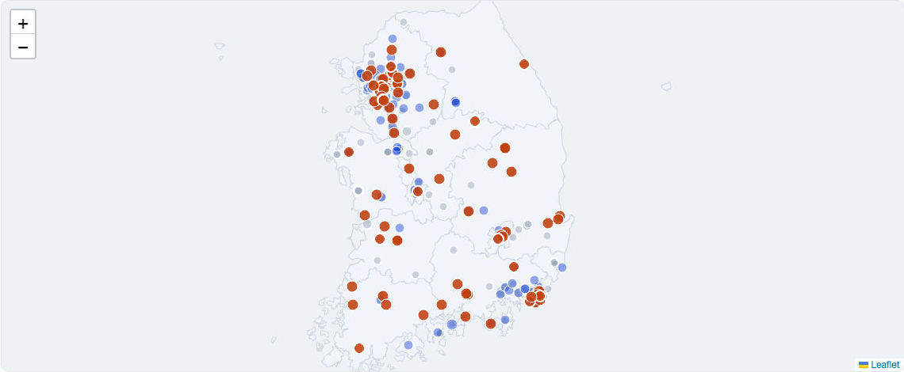

<div align="center">

# 두 목록의 어긋남

### 국가는 같은 죽음을 두 번 세고, 두 목록은 서로 다른 곳을 가리킨다

보행노인 · 보행자 교통사고 다발지역 고시의 **전국 공간 대조**

[](https://link.chlee.dev/gap2.html)
[](https://www.python.org/)
[](#실행)
[](#라이선스)

**2026 한겨레 × 숲과나눔 「AI와 함께하는 교통문제 해결을 위한 데이터 분석 공모전」 · 팀 폴라앱**

</div>

---

## 한 문장

> 도로교통공단은 같은 현상(보행자 사망·중상)을 **두 개의 고시 목록**으로 따로 관리하는데,
> 그 두 목록의 임계값이 **5건과 7건으로 달라서**
> **사망 25명·중상 457명이 발생한 93개 지점이 한쪽 목록에서만 보인다.**

사고를 **예측하지 않는다.** 새로운 위험을 주장하지도 않는다.
이 코드가 하는 일은 **국가가 이미 공개해 둔 두 장의 목록을 겹쳐 보는 것** 하나다.

| | |
|---|---|
| 「여기가 위험합니다」 | 틀리면 책임이 생기는 **판단** |
| **「이 목록과 저 목록이 다릅니다」** | **틀릴 여지가 없는 대조** ← 이 프로젝트 |

---

## 문제 — 눈금이 다른 두 개의 자

<table>
<tr><th>목록</th><th>대상사고</th><th>집계기간</th><th>반경</th><th>임계값</th></tr>
<tr><td><b>보행자</b> 사고다발지역</td><td>보행자 사망·중상</td><td>최근 3년</td><td>100m</td><td align="center"><b>7건 이상</b></td></tr>
<tr><td><b>보행노인</b> 사고다발지역</td><td><b>65세 이상</b> 보행자 사망·중상</td><td>최근 3년</td><td>100m</td><td align="center"><b>5건 이상</b></td></tr>
</table>

**집계기간·반경·중증도가 완전히 동일하고, 다른 것은 임계값과 연령 필터뿐이다.**
통계적으로 말하면 **교란변수가 설계 단계에서 이미 통제되어 있다** — 두 목록의 차이를
인구 규모나 통행량이나 측정 방법으로 설명할 수 없다. 차이는 **임계값에서만** 나온다.

> 2012~2020년 보행노인 목록은 「1년 · 200m · 3건 · 부상 포함」 기준이었다.
> 2021년에 기준이 단절되므로 **시계열은 2022년 고시분 이후만** 사용한다.

---

## 결과

<div align="center">

| 보행노인 목록 | 보행자 목록 | 겹침 | **노인 목록에만** | 보행자 목록에만 |
|:---:|:---:|:---:|:---:|:---:|
| 291곳 | 418곳 | 198곳 | **93곳 (32.0%)** | 223곳 (53.3%) |

</div>

보행노인 목록의 **3곳 중 1곳**이 보행자 목록에 없다. 그 93곳에서 **사망 25명 · 중상 457명**.
반대 방향은 더 크다 — 보행자 목록의 **절반 이상(53.3%)** 이 보행노인 목록에 없다.
**두 목록은 같은 곳을 다르게 부르는 것이 아니라, 애초에 서로 다른 절반을 보고 있다.**

<div align="center">

</div>

---

## 핵심 발견 — 어긋남은 우연이 아니라 임계값이 만든 구조다

93곳은 **어쩌다** 빠진 것인가, **구조적으로 빠질 수밖에** 없었던 것인가.
전용 지점들의 사고건수 분포를 보면 즉시 결판난다.

<div align="center">

</div>

| 사고건수 | 5건 | 6건 | 7건 이상 | 합계 |
|:---|---:|---:|---:|---:|
| 노인 전용 지점 | **81** | **11** | 1 | 93 |
| 비율 | 87.1% | 11.8% | 1.1% | 100% |

> ### 93곳 중 92곳(98.9%)이 사고 5~6건 구간에 있다.
> 보행노인 기준(5건)은 넘었지만 보행자 기준(7건)은 **넘지 못한다.**
> 어긋남은 우연의 산물이 아니라 **임계값 5건과 7건의 차이가 기계적으로 만들어낸 구조**다.
> 이 구조는 데이터가 쌓여도 **저절로 해소되지 않는다.**

---

## 격차는 좁혀지지 않고 벌어지고 있다

<div align="center">

</div>

| 고시 연도 | 2022 | 2023 | 2024 | 2025 | 2026 |
|:---|---:|---:|---:|---:|---:|
| 보행노인 지점 | 269 | 245 | 228 | 262 | **291** |
| 보행자 지점 | 609 | 470 | 459 | 446 | **418** |
| **어긋남 비율** | 23.4% | 31.0% | 26.8% | 27.1% | **32.0%** |

보행자 목록은 609곳 → 418곳으로 **31% 줄었다.** 보행 안전은 전반적으로 개선되고 있다.
그런데 같은 기간 보행노인 목록은 269곳 → **291곳으로 오히려 늘었다.**
**전체가 좋아지는 동안 고령 보행자 쪽만 반대로 움직였다.**

---

## 웹 데모

### → **https://link.chlee.dev/gap2.html** (로그인·설치 불필요)

<div align="center">


</div>

- **연도 전환** — 2022~2026년 5개 연도를 즉시 오가며 어긋남의 변화를 본다
- **3분류 필터** — 노인 전용 / 겹침 / 일반 전용을 범례 클릭으로 켜고 끈다
- **지점 상세** — 지점명 · 사고건수 · 사망 · 중상자 수
- **외부 의존 0** — **지도 타일 서버를 쓰지 않는다.** 시도 행정경계를 문서 안에 내장해
  **단일 HTML 파일**로 동작하므로 네트워크 제약이 있어도 화면이 깨지지 않는다

---

## 방법

<div align="center">

</div>

### 격자 인덱스 기반 최근접 공간 대조

두 목록을 짝지으려면 원칙적으로 모든 쌍의 거리를 재야 한다(연도당 291 × 418 ≈ **12만 회**).
이를 **격자 인덱스**로 선형 시간으로 낮췄다 — 좌표를 소수점 둘째 자리로 반올림해
약 1km 격자에 담고, **자기 격자와 8개 인접 격자(3×3)만** 탐색한다.
**매칭 반경보다 격자가 크므로 결과는 전수 탐색과 정확히 동일하다. 근사가 아니다.**

| 설계 | 값 | 근거 |
|---|---|---|
| 거리 함수 | 위도 111,320 m/도, 경도 cos(위도) 보정 | 전국 범위 오차 1% 미만, 외부 라이브러리 불필요 |
| **매칭 반경** | **150m** | 두 목록 모두 **반경 100m 원**이므로, 같은 교차로를 가리키는 두 원의 중심은 150m 안에 들어온다 |
| 매칭 방식 | 최근접 1:1, 짝지어진 지점 재사용 없음 | 한 지점의 중복 계상 차단 |
| 분류 | 노인 전용 / 겹침 / 일반 전용 | 정책적으로 의미가 다른 세 집단 분리 |

### 재현성

전 과정이 **결정적(deterministic)** 이다. 난수 시드도, 학습 파라미터도, 실시간 API 호출도 **하나도 없다.**
동일 CSV 를 넣으면 **누구나 동일한 숫자**를 얻는다.

---

## 실행

```bash
git clone https://github.com/iamhuman-cheolheelee/koroad-gap
cd koroad-gap
# data/ 에 두 CSV 를 내려받아 둔다 (아래 「데이터」 참조)

python3 src/analyze.py       # 전체 분석        → data/result.json
python3 src/export_demo.py   # 데모용 지점 배열  → data.json
python3 src/build.py         # 단일 HTML 데모   → index.html
python3 src/make_figs.py     # 보고서용 SVG 4장 → figures/
```

**Python 3.12 · 설치할 패키지 없음**(`csv` `json` `math` `collections` 만 사용).
`pip install` 이 필요 없고, 가상환경도 필요 없다.

```
src/analyze.py       두 목록 적재 · 격자 인덱스 매칭 · 7개 분석 블록 출력
src/export_demo.py   연도별 3분류 지점을 데모용 배열로 직렬화
src/simplify_map.py  시도 경계 GeoJSON 을 Douglas-Peucker 로 7.5MB → 114KB
src/build.py         템플릿에 데이터·경계를 주입해 단일 HTML 생성
src/make_figs.py     인쇄 해상도 벡터 SVG 직접 생성 (matplotlib 미사용)
```

---

## 데이터

원본 CSV 는 **라이선스상 재배포하지 않는다.** 아래에서 직접 내려받아 `data/` 에 둔다.

| 데이터명 | 제공기관 | 플랫폼 | URL |
|---|---|---|---|
| **보행노인 교통사고 다발지역** | 한국도로교통공단 | 공공데이터포털 | https://www.data.go.kr/data/15057666/openapi.do |
| **보행자 교통사고 다발지역** | 한국도로교통공단 | 공공데이터포털 → 제공처 | https://www.data.go.kr/data/15105289/fileData.do |
| 전국 CSV 직접 배포 | 한국도로교통공단 | opendata.koroad.or.kr | https://opendata.koroad.or.kr |
| 시도 행정경계 GeoJSON | 통계청 행정구역경계 기반 공개 자료 | southkorea-maps | https://github.com/southkorea/southkorea-maps |

- **기준시점** 2026년 고시본 (시계열은 2022~2026년 5개 연도)
- **인코딩** cp949 · **고시 연도**는 `사고다발지id` 앞 4자리에 들어 있다
- **주요 변수** 지점명, 시도시군구명, 사고건수, 사상자수, 사망자수, 중상자수, 경도, 위도
- **이용조건** 각 제공기관 공공데이터 이용약관

> **수집 윤리.** 보행노인 데이터는 공공데이터포털에서 **정식 활용신청 후 승인**받아 오픈API로 받았다.
> 보행자 데이터는 포털에 활용신청 기능이 없는 제공처 바로가기형이라,
> 제공처가 **회원 인증 없이 공개 배포하는 전국 CSV** 를 내려받았다.
> **접근권한 우회 · 무단 계정 · 약관에 반하는 크롤링은 어느 단계에서도 사용하지 않았다.**

---

## 검증하지 못한 것 — 정직하게 적는다

초기 가설은 「노인 전용 지점이 더 치명적일 것」이었다. **데이터는 이를 지지하지 않았다.**

| 가설 | 실측 | 판정 |
|---|---|---|
| 노인 전용 지점이 더 치명적이다 | 치사율 5.19% vs 겹침 4.72% (**1.10배**) | **기각** — 주장의 근거로 쓸 수 없다 |
| 어긋남이 비도시에 몰린다 | 군 43.5% vs 시·구 31.0%, 그러나 **군 치사율이 1.82%로 오히려 낮고 N=23** | **보류** — 표본이 작다 |

**본 프로젝트는 이 두 가설을 모두 버리고, 사고건수 분포라는 반박 불가능한 증거 하나에만 결론을 세운다.**

---

## AI 활용

**Claude Opus 5 (Anthropic · Claude Code)** 를 **가설 반증**과 **코드 작성**에 사용했다.
위험도 판정 · 순위 산정 · 정책 결론에는 **일절 사용하지 않았다.**
실제로 위 표의 초기 가설은 **AI 와의 반증 과정에서 데이터에 의해 기각**되었다.

---

## 라이선스

코드 **MIT**. 데이터는 각 제공기관의 이용약관을 따른다.
