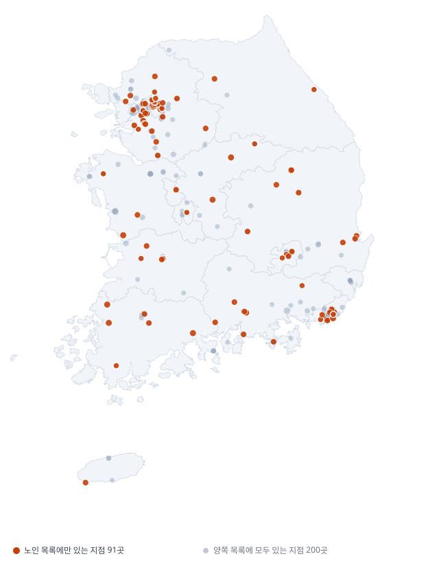
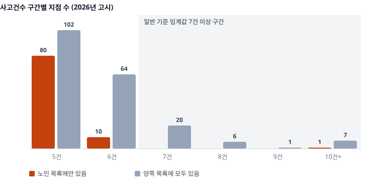
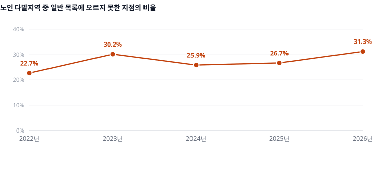
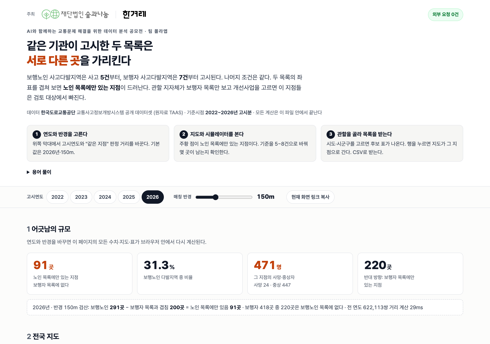
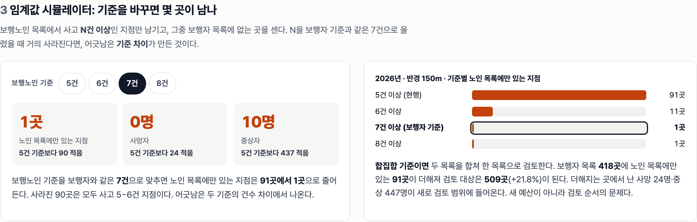
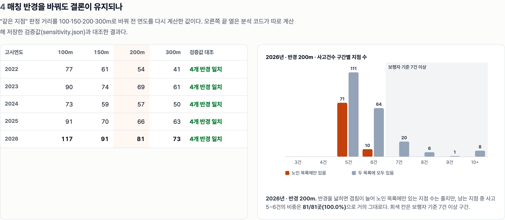
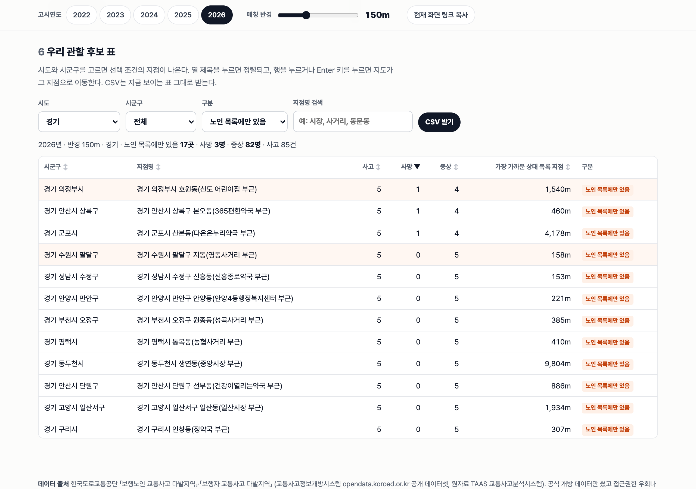
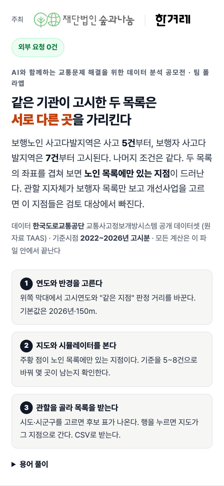
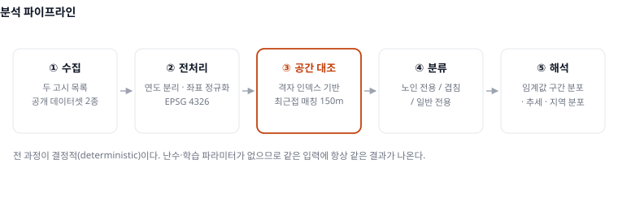

<div align="center">

# 두 목록의 어긋남

### 국가는 같은 죽음을 두 번 세고, 두 목록은 서로 다른 곳을 가리킨다

보행노인 · 보행자 교통사고 다발지역 고시의 **전국 공간 대조**

[](https://link.chlee.dev/tnk57b.html)
[](https://link.chlee.dev/00j4es.pdf)
[](https://link.chlee.dev/28169z.mp4)
[](https://www.python.org/)
[](#실행)
[](#라이선스)

**2026 한겨레 × 숲과나눔 「AI와 함께하는 교통문제 해결을 위한 데이터 분석 공모전」 · 팀 폴라앱 (이철희 · 최윤진)**

</div>

---

## 한 문장

> 도로교통공단은 보행자 사망·중상이라는 같은 현상을 **두 개의 고시 목록**으로 따로 관리한다.
> 두 목록의 임계값이 **5건과 7건으로 달라서**,
> **사망 24명·중상 447명이 발생한 91개 지점이 한쪽 목록에만 올라 있다.**

이 프로젝트는 사고를 **예측하지 않고**, 새로운 위험을 주장하지도 않는다.
**국가가 이미 공개한 두 목록을 겹쳐 보는 일** 하나만 한다.

| | |
|---|---|
| 「여기가 위험합니다」 | 틀리면 책임이 따르는 **판단** |
| **「이 목록과 저 목록이 다릅니다」** | **틀릴 여지가 없는 대조** ← 이 프로젝트 |

---

## 문제: 눈금이 다른 두 개의 자

<table>
<tr><th>목록</th><th>대상사고</th><th>집계기간</th><th>반경</th><th>임계값</th></tr>
<tr><td><b>보행자</b> 사고다발지역</td><td>보행자 사망·중상</td><td>최근 3년</td><td>100m</td><td align="center"><b>7건 이상</b></td></tr>
<tr><td><b>보행노인</b> 사고다발지역</td><td><b>65세 이상</b> 보행자 사망·중상</td><td>최근 3년</td><td>100m</td><td align="center"><b>5건 이상</b></td></tr>
</table>

두 목록은 **집계기간·반경·중증도가 같고, 임계값과 연령 필터만 다르다.**
설계 단계에서 이미 교란변수가 통제된 셈이다. 인구 규모나 통행량, 측정 방법으로는
두 목록의 차이를 설명할 수 없고, 차이는 **임계값에서만** 생긴다.

> 2012~2020년 보행노인 목록은 「1년 · 200m · 3건 · 부상 포함」 기준이었다.
> 2021년에 기준이 바뀌었으므로 **시계열은 2022년 고시분부터** 쓴다.

---

## 결과 (2026년 고시)

<div align="center">

| 보행노인 목록 | 보행자 목록 | 겹침 | **노인 목록에만** | 보행자 목록에만 |
|:---:|:---:|:---:|:---:|:---:|
| 291곳 | 418곳 | 200곳 | **91곳 (31.3%)** | 220곳 (52.6%) |

</div>

보행노인 목록의 **3곳 중 1곳**이 보행자 목록에 없다. 이 91곳에서 **사망 24명, 중상 447명**이 나왔다.
반대 방향은 더 크다. 보행자 목록의 **절반 이상(52.6%)** 이 보행노인 목록에 없다.
**두 목록은 같은 곳을 달리 부르는 것이 아니라, 처음부터 서로 다른 절반을 보고 있다.**

<div align="center">

</div>

---

## 핵심 발견: 어긋남은 임계값이 만든 구조다

91곳은 우연히 빠졌을까, 구조적으로 빠질 수밖에 없었을까.
노인 전용 지점의 사고건수 분포를 보면 답이 나온다.

<div align="center">

</div>

| 사고건수 | 5건 | 6건 | 7건 이상 | 합계 |
|:---|---:|---:|---:|---:|
| 노인 전용 지점 | **80** | **10** | 1 | 91 |
| 비율 | 87.9% | 11.0% | 1.1% | 100% |

> ### 91곳 중 90곳(98.9%)이 사고 5~6건 구간에 있다.
> 보행노인 기준(5건)은 넘었지만 보행자 기준(7건)에는 **못 미친다.**
> 어긋남은 **임계값 5건과 7건의 차이가 기계적으로 만든 구조**이고,
> 데이터가 쌓인다고 **저절로 사라지지 않는다.**

---

## 격차는 좁혀지지 않았다

<div align="center">

</div>

| 고시 연도 | 2022 | 2023 | 2024 | 2025 | 2026 |
|:---|---:|---:|---:|---:|---:|
| 보행노인 지점 | 269 | 245 | 228 | 262 | **291** |
| 보행자 지점 | 609 | 470 | 459 | 446 | **418** |
| 노인 목록에만 | 61 | 74 | 59 | 70 | **91** |
| **어긋남 비율** | 22.7% | 30.2% | 25.9% | 26.7% | **31.3%** |

보행자 목록은 609곳에서 418곳으로 **31% 줄었다.** 보행 안전은 전반적으로 나아지고 있다.
그런데 같은 기간 보행노인 목록은 269곳에서 **291곳으로 오히려 늘었고**, 어긋남 비율은 5년 중 가장 높다.
**전체가 좋아지는 동안 고령 보행자 쪽만 반대로 움직였다.**

---

## 웹 데모와 시연 영상

### 데모: **https://link.chlee.dev/tnk57b.html** (로그인·설치 불필요)
### 영상: **https://link.chlee.dev/28169z.mp4** (88초)

<div align="center">




</div>

- **연도 전환**: 2022~2026년 5개 연도를 오가며 어긋남의 변화를 본다
- **임계값 시뮬레이터**: 보행노인 기준을 N건으로 올렸을 때 노인 목록에만 남는 지점이 몇 곳인지 센다. 7건이면 거의 사라진다
- **매칭 반경 슬라이더**: 100/150/200/300m 결과를 바로 비교한다 (`data/sensitivity.json` 과 같은 값)
- **시군구 드릴다운**: 관할별 노인 전용 지점 수와 지점 목록을 표로 정렬해 본다
- **외부 요청 0**: Leaflet·시도 경계·데이터를 모두 **단일 HTML 파일** 안에 넣어, 네트워크 제약이 있어도 화면이 깨지지 않는다

<div align="center">

</div>

---

## 방법

<div align="center">

</div>

### 격자 인덱스 기반 최근접 공간 대조

두 목록을 짝지으려면 원칙적으로 모든 쌍의 거리를 재야 한다(연도당 291 × 418 ≈ **12만 회**).
**격자 인덱스**로 이를 선형 시간으로 줄였다. 좌표를 약 1km 격자에 담고
**자기 격자와 인접 8개 격자(3×3)만** 탐색한다.
격자가 매칭 반경보다 크므로 결과는 전수 탐색과 **정확히 같다.** 5개 연도 모두
격자 방식과 전수 비교의 노인 전용 지점 집합이 일치함을 `src/sensitivity.py` 로 확인했다.

| 설계 | 값 | 근거 |
|---|---|---|
| 거리 함수 | 위도 111,320 m/도, 경도 cos(위도) 보정 | 전국 범위 오차 1% 미만, 외부 라이브러리 불필요 |
| **매칭 반경** | **150m** | 두 목록 모두 **반경 100m 원**이라, 같은 교차로를 가리키는 두 원의 중심은 150m 안에 들어온다 |
| 매칭 방식 | 최근접 1:1, 짝지어진 지점 재사용 없음 | 한 지점을 두 번 세지 않는다 |
| 분류 | 노인 전용 / 겹침 / 보행자 전용 | 정책적 의미가 다른 세 집단을 나눈다 |

### 강건성 점검 (`data/sensitivity.json`)

| 2026년 | 반경 100m | **150m (기준)** | 200m | 300m |
|:---|---:|---:|---:|---:|
| 노인 전용 지점 | 117 | **91** | 81 | 73 |
| 그중 5~6건 구간 | 112 | **90** | 81 | 73 |

반경을 어떻게 잡아도 노인 전용 지점의 95% 이상이 5~6건 구간에 몰린다.
보행자 지점 재사용을 막는 엄격한 1:1 매칭에서도 94곳 중 92곳으로 결론이 같다.

### 재현성

전 과정이 **결정적(deterministic)** 이다. 난수 시드, 학습 파라미터, 실시간 API 호출이 **없다.**
같은 CSV 를 넣으면 누가 돌려도 같은 숫자가 나온다.

---

## 실행

```bash
git clone https://github.com/iamhuman-cheolheelee/koroad-gap
cd koroad-gap
# data/ 에 원본 CSV 두 개를 내려받아 둔다 (아래 「데이터」 참조)

python3 src/analyze.py       # 전체 분석, 2026년 노인 전용 91곳  → data/result.json
python3 src/sensitivity.py   # 격자=전수 검증 · 반경 민감도      → data/sensitivity.json
python3 src/export_demo.py   # 데모용 연도별 지점 배열           → src/data.json
python3 src/build.py         # 단일 HTML 데모                    → src/index.html
python3 src/make_figs.py     # 보고서용 SVG 4장                  → figures/
```

**Python 3.12, 설치할 패키지 없음**(`csv` `json` `math` `collections` 만 사용).
`pip install` 도 가상환경도 필요 없다. 저장소에 들어 있는 `data/result.json`·`data/sensitivity.json` 은
위 명령으로 다시 만든 결과와 바이트 단위로 같다.

```
src/analyze.py       두 목록 적재 · 격자 인덱스 매칭 · 7개 분석 블록 출력
src/sensitivity.py   격자 vs 전수 비교, 반경 100/150/200/300m, 엄격 1:1 매칭
src/export_demo.py   연도별 3분류 지점을 데모용 배열로 직렬화
src/simplify_map.py  시도 경계 GeoJSON 을 Douglas-Peucker 로 7.5MB → 114KB (src/sido.json)
src/build.py         템플릿(index.tpl.html)에 데이터·경계·Leaflet 을 넣어 단일 HTML 생성
src/make_figs.py     인쇄 해상도 벡터 SVG 직접 생성 (matplotlib 미사용)
src/vendor/          Leaflet (BSD-2-Clause)
```

---

## 데이터

원본 CSV 는 저장소에 넣지 않았다. 아래에서 내려받아 `data/` 에 다음 파일명으로 둔다.

| 파일명 | 데이터명 | 제공기관 | URL |
|---|---|---|---|
| `data/12_25_oldman.csv` | **보행노인 교통사고 다발지역** (2012~2025 집계) | 한국도로교통공단 | https://www.data.go.kr/data/15057666/openapi.do |
| `data/19_25_pedstrians.csv` | **보행자 교통사고 다발지역** (2019~2025 집계) | 한국도로교통공단 | https://www.data.go.kr/data/15105289/fileData.do |
| | 전국 CSV 직접 배포 | 한국도로교통공단 | https://opendata.koroad.or.kr |
| `src/sido.json` | 시도 행정경계 GeoJSON (간소화본 포함) | 통계청 행정구역경계 기반 공개 자료 | https://github.com/southkorea/southkorea-maps |

- **기준시점** 2026년 고시본 (시계열은 2022~2026년 5개 연도)
- **인코딩** cp949. **고시 연도**는 `사고다발지id` 앞 4자리에 있다
- **주요 변수** 지점명, 시도시군구명, 사고건수, 사상자수, 사망자수, 중상자수, 경도, 위도
- **이용조건** 각 제공기관의 공공데이터 이용약관

> **수집 윤리.** 보행노인 데이터는 공공데이터포털에서 **정식 활용신청 후 승인**을 받아 오픈API로 받았다.
> 보행자 데이터는 포털에 활용신청 기능이 없는 제공처 바로가기형이라,
> 제공처가 **회원 인증 없이 공개 배포하는 전국 CSV** 를 내려받았다.
> **접근권한 우회, 무단 계정, 약관에 어긋나는 크롤링은 어느 단계에서도 쓰지 않았다.**

---

## 검증하지 못한 것

초기 가설은 「노인 전용 지점이 더 치명적일 것」이었다. **데이터는 이를 지지하지 않았다.**

| 가설 | 실측 (2026년) | 판정 |
|---|---|---|
| 노인 전용 지점이 더 치명적이다 | 치사율 5.10% vs 겹침 4.76% (**1.07배**) | **기각**: 주장의 근거로 쓰지 않는다 |
| 어긋남이 비도시에 몰린다 | 군 43.5%(10/23곳) vs 시·구 30.2%, 그러나 **군 치사율이 1.82%로 오히려 낮고 N=23** | **보류**: 표본이 작다 |

**두 가설을 모두 내려놓고, 사고건수 분포라는 반박하기 어려운 증거 하나에만 결론을 세웠다.**

---

## AI 활용

**Claude (Anthropic · Claude Code)** 를 **가설 반증**과 **코드 작성**에 썼다.
위험도 판정, 순위 산정, 정책 결론에는 쓰지 않았다.
위 표의 초기 가설도 **AI 와 반증하는 과정에서 데이터로 기각**됐다.

---

## 라이선스

코드는 **MIT**. 데이터는 각 제공기관의 이용약관을, Leaflet 은 BSD-2-Clause 를 따른다.
